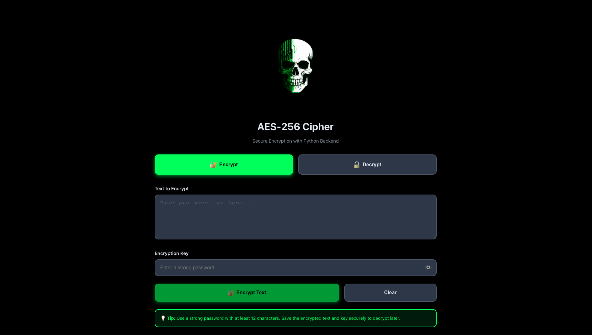
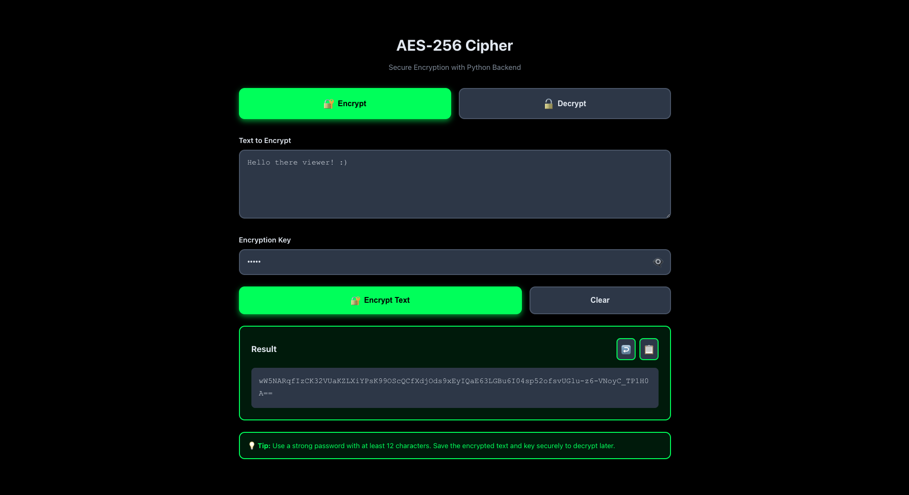
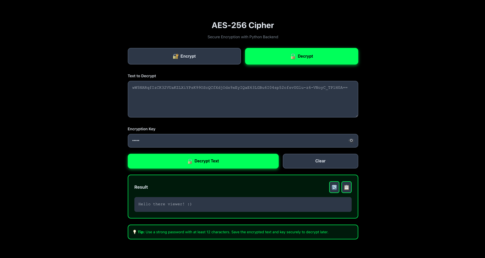

<div align="center">

# 🕵️ PyCrypto-Electron-Client: The Secret Keeper

**Your desktop vault for encrypting secrets—minus the complexity.** A sleek cross-platform encryption app built by wrapping military-grade Python cryptography in a modern React UI, all bundled in an Electron shell.

</div>

## 💡 Description

I built PyCrypto-Electron-Client to demonstrate how to architect a secure desktop application that bridges modern frontend technologies with powerful backend processing. It's an AES-256 encryption tool where users can encrypt and decrypt messages with military-grade security—all running locally on their machine with zero network exposure.

This isn't just another crypto toy—it's a showcase of **inter-process communication**, **secure cryptographic patterns**, and **cross-platform desktop deployment**, proving you can build professional-grade security tools without compromising on user experience.

### Key Architectural Highlights:

- **Secure IPC Architecture:** All encryption/decryption requests travel securely via **Inter-Process Communication (IPC)** from the React frontend through Electron's main process to the Python backend. The frontend never touches sensitive cryptographic operations.
- **Python Cryptography Muscle:** All heavy-duty cryptographic work is handled by Python's battle-tested `cryptography` library using AES-256-CBC mode. JavaScript stays in its lane—UI only.
- **PBKDF2 Key Derivation:** Passwords aren't used directly. They're transformed through **PBKDF2-HMAC-SHA256** with 100,000 iterations, random salt, and random IV generation for each encryption. Good luck brute-forcing that.
- **Zero Network Exposure:** Everything runs locally. Your secrets never leave your machine. No servers, no APIs, no tracking—just pure client-side encryption.
- **Single Executable Distribution:** Using `electron-builder` and `python-shell`, the entire React frontend, Electron runtime, and Python environment bundle into one clean installer for Windows, macOS, and Linux.

---

## 🧰 Tech Stack

<p align="center">
  
  
  
  
  
</p>

---

## 🎯 Features

### 🔐 Military-Grade Encryption

- **AES-256-CBC:** Industry-standard symmetric encryption algorithm
- **PBKDF2 Key Derivation:** 100,000 iterations with SHA-256 hashing
- **Random Salt & IV:** Unique cryptographic parameters for each encryption operation
- **PKCS7 Padding:** Proper block cipher padding for data integrity

### 🎨 Modern User Interface

- **Dark Theme:** Eye-friendly UI with glassmorphic design elements
- **Toggle Visibility:** Show/hide encryption keys for security
- **Copy to Clipboard:** One-click copying of encrypted/decrypted output
- **Real-time Validation:** Instant feedback for missing inputs or errors

### 🖥️ Cross-Platform Desktop App

- **Windows, macOS, Linux:** Single codebase, multiple platforms
- **No Installation Required:** Portable executables (when built with electron-builder)
- **Offline Operation:** No internet connection needed
- **Native Performance:** Fast, responsive desktop experience

### 🔒 Security First

- **Zero Network Calls:** All processing happens locally
- **No Data Storage:** Messages and keys are never persisted
- **Isolated Python Process:** Cryptographic operations run in a separate process
- **Base64 Encoding:** Safe storage and transmission format for encrypted data

---

## 🖼️ Screenshots

<p align="center">
  
</p>
<p align="center">
  <strong>Screenshot 1:</strong> The main encryption interface with input fields for plaintext and encryption key.
</p>

<p align="center">
  
</p>
<p align="center">
  <strong>Screenshot 2:</strong> Successfully encrypted message with copy-to-clipboard functionality.
</p>

<p align="center">
  
</p>
<p align="center">
  <strong>Screenshot 3:</strong> Decryption mode showing the reversal of encrypted data back to plaintext.
</p>

---

## ⚙️ How to Develop

### Prerequisites

You'll need:

- **Node.js** (v16 or later) and **npm**
- **Python 3** (v3.8 or later)
- **Git** (for cloning the repository)

### Setup Instructions

```bash
# 1. Clone the repository
git clone https://github.com/Nordtess/PyCrypto-Electron-Client
cd PyCrypto-Electron-Client

# 2. Install Electron dependencies
npm install

# 3. Install React dependencies
cd src
npm install
cd ..

# 4. Install Python dependencies
pip install -r requirements.txt

# 5. Run the application
npm start
```

The application will:

1. Build the React frontend (Vite)
2. Start the Electron main process
3. Load the bundled React UI
4. Connect to the Python backend via IPC

---

## 📦 Building for Distribution

To create platform-specific installers:

```bash
# Build for your current platform
npm run dist

# Output will be in the dist/ folder
# - Windows: .exe installer
# - macOS: .dmg installer
# - Linux: .AppImage or .deb
```

The build includes:

- Minified React bundle
- Electron runtime
- Python executable and dependencies
- All assets and resources

---

## 🏗️ Project Structure

```
PyCrypto-Electron-Client/
├── main.js                 # Electron main process (IPC handler)
├── preload.js             # Electron preload script (security bridge)
├── package.json           # Electron dependencies & build scripts
├── requirements.txt       # Python dependencies
├── python/
│   └── aes_handler.py    # AES-256 encryption/decryption logic
├── src/                  # React frontend (Vite)
│   ├── src/
│   │   ├── App.jsx       # Main React component
│   │   ├── App.css       # Styling
│   │   └── main.jsx      # React entry point
│   ├── index.html        # HTML template
│   ├── package.json      # React dependencies
│   └── vite.config.js    # Vite build configuration
└── build/                # Production build output
```

---

## 🔐 How It Works

### Encryption Flow:

1. **User Input:** User enters plaintext and encryption key in React UI
2. **IPC Request:** React sends encryption request via `window.aesAPI.runAES()`
3. **Electron Bridge:** Main process receives request via `contextBridge` API
4. **Python Execution:** Electron spawns Python process with `python-shell`
5. **Cryptographic Processing:**
   - Generate random 16-byte salt
   - Derive 256-bit key using PBKDF2 (100,000 iterations)
   - Generate random 16-byte IV
   - Encrypt plaintext using AES-256-CBC
   - Combine: `salt + iv + ciphertext`
   - Base64 encode the result
6. **Response:** Python returns encrypted data to Electron → React UI

### Decryption Flow:

1. User pastes Base64-encoded ciphertext and original key
2. Python decodes Base64 → extracts salt, IV, and ciphertext
3. Derives same key using PBKDF2 with extracted salt
4. Decrypts using AES-256-CBC with extracted IV
5. Returns original plaintext

---

## 🔍 Security Considerations

**What makes this secure:**
✅ AES-256 is military-grade encryption (NSA-approved)  
✅ PBKDF2 with 100,000 iterations prevents brute-force attacks  
✅ Random salt and IV prevent rainbow table attacks  
✅ All processing is local (zero network exposure)  
✅ Keys are never stored or logged

**What to keep in mind:**
⚠️ **Key strength matters:** Use long, random passwords  
⚠️ **This is for demonstration:** Not audited for production use  
⚠️ **Key management:** If you lose the key, data is unrecoverable

---

## 🛠️ Technologies & Patterns Used

**Frontend:**

- React 18 (functional components + hooks)
- Vite (lightning-fast HMR and bundling)
- CSS3 (glassmorphism, animations)
- Vanilla JavaScript (no heavy frameworks)

**Desktop Shell:**

- Electron 39 (Chromium + Node.js runtime)
- IPC (Inter-Process Communication)
- Context Isolation & Preload Scripts (security)
- `python-shell` (Node.js ↔ Python bridge)

**Backend:**

- Python 3
- `cryptography` library (PyCA)
- AES-256-CBC encryption
- PBKDF2-HMAC-SHA256 key derivation
- PKCS7 padding

**Build Tools:**

- electron-builder (packaging & distribution)
- Vite (React build system)
- npm scripts (automation)

---

## 📝 Future Enhancements (Roadmap)

- [ ] File encryption support (encrypt entire files, not just text)
- [ ] Drag-and-drop file interface
- [ ] Multiple encryption algorithms (RSA, ChaCha20)
- [ ] Key file generation (.key files)
- [ ] Encrypted vault/storage system
- [ ] Auto-update mechanism
- [ ] Internationalization (i18n) support

---

## 👨‍💻 Author

**Nordtess**  
_Full-Stack Developer & Security Enthusiast_ (tryhard wannabe)

---

## 📜 License

This project is licensed under the MIT License—feel free to use it, learn from it, or build upon it!

---

<div align="center">

**Built with ❤️, Python, and paranoia in Sweden 🇸🇪**

_"Because your secrets deserve better than a sticky note."_

</div>
